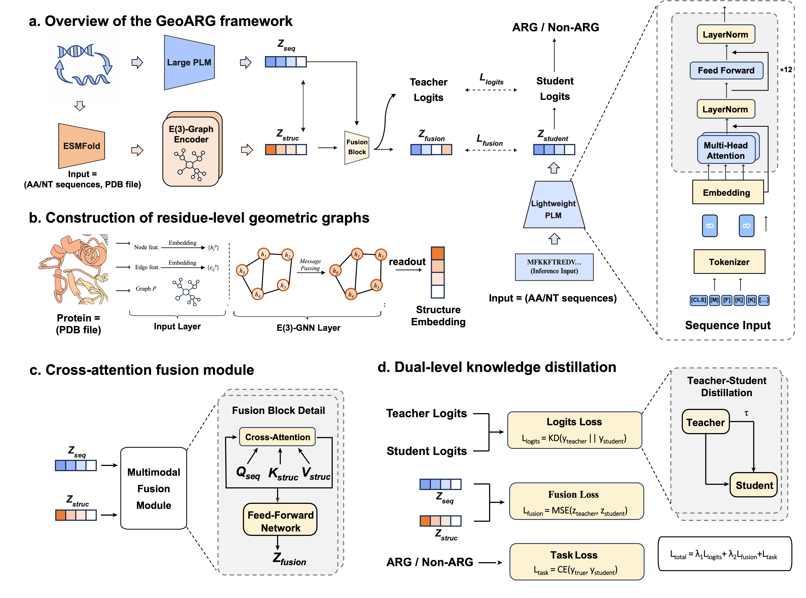

# GeoARG

**Geometry-Enhanced Protein Language Modeling Enables Discovery of Novel Antibiotic Resistance Genes**


---

## Why GeoARG?

Sequence-homology tools miss ARGs that have diverged beyond recognition — yet still perform the same resistance function. **GeoARG** closes this gap by incorporating three-dimensional catalytic-site geometry into training, then distilling that structural knowledge into a lightweight sequence-only student model for large-scale deployment.

- Identifies ARGs **across all four input types**: long/short nucleotide and amino acid sequences — no separate models needed
- Detects remote homologs down to **<25% sequence identity** to known ARGs
- Runs inference at **15.4× the speed** of the full structural model with no measurable performance loss
- Applied to 49,707 unannotated gut metagenomic sequences → **1,485 high-confidence novel ARG candidates**

---

## Architecture#

<div align="center">

</div>
 
<br/>

GeoARG follows a **teacher–student** design with three coordinated modules:

| Module | Role |
|--------|------|
| **Large PLM (ESM2-650M)** + **E(3)-Graph Encoder** | Extract sequence embeddings and residue-level structural geometry |
| **Multimodal Fusion Block** | Fuse sequence and structure via cross-attention ($Q_\text{seq}$, $K_\text{struc}$, $V_\text{struc}$) |
| **Knowledge Distillation** | Transfer teacher's structural knowledge to a lightweight student PLM (ESM2-35M) at both logit and embedding levels |

**Distillation objective:**

$$\mathcal{L} = \lambda_1 \underbrace{\mathrm{KL}(y_\text{teacher} \| y_\text{student})}_{\mathcal{L}_\text{logits}} + \lambda_2 \underbrace{\tfrac{1}{d}\|z_\text{teacher} - z_\text{student}\|_2^2}_{\mathcal{L}_\text{fusion}} + \underbrace{\mathrm{CE}(y_\text{true},\, y_\text{student})}_{\mathcal{L}_\text{task}}$$

At inference, **only the student is used** — no structure required.

---

## Results

### ARG Identification (UniProt benchmark)

| Method | Accuracy | MCC | AUROC |
|--------|:--------:|:---:|:-----:|
| **GeoARG** | **0.9892** | **0.9684** | **0.9999** |
| ARGNet | 0.9639 | 0.9076 | 0.9975 |
| HMD-ARG | 0.9521 | 0.9101 | 0.9597 |
| DeepARG | 0.9418 | 0.9041 | 0.9618 |

### Remote Homolog Detection (ResFinderFG, 0–40% identity bin)

| Method | Recall |
|--------|:------:|
| **GeoARG** | **0.48** |
| HMD-ARG | 0.11 |
| ARGNet | 0.02 |

### Inference Efficiency

| Model | Parameters | Time (s) | Speedup |
|-------|:----------:|:--------:|:-------:|
| Teacher (ESM2-650M + E(3)-GNN) | 663.8M | 1709 | 1× |
| **Student (ESM2-35M)** | **33.5M** | **111** | **15.4×** |

---

## Installation

```bash
git clone https://github.com/ycclab/GeoARG.git
cd GeoARG

conda create -n geoarg python=3.10 -y
conda activate geoarg

pip install torch torchvision --index-url https://download.pytorch.org/whl/cu118
pip install fair-esm biopython safetensors tqdm scikit-learn
```

**Requirements:** Python ≥ 3.10 · PyTorch ≥ 2.0 · CUDA 11.8+ · 24 GB VRAM (teacher training) · 8 GB VRAM (student inference)

---

## Usage

### Inference

```python
import torch
from models import GeoARGStudent
from safetensors.torch import load_file

device = torch.device("cuda")
student = GeoARGStudent(num_classes=2, proj_dim=512).to(device)
student.load_state_dict(load_file("checkpoints/student_best.safetensors"))
student.eval()

sequences = ["MKKFTREDWLNKLMG..."]
with torch.no_grad():
    logits, z = student(sequences, device)
    prob = torch.softmax(logits, dim=-1)[1].item()
    print(f"ARG probability: {prob:.4f}")
```

### Training

```bash
python train.py
```

Configure paths in `train.py`:

```python
TRAIN_CSV = "/path/to/arg_train.csv"   # columns: header, sequence, label1
TEST_CSV  = "/path/to/arg_test.csv"
TRAIN_PDB = "/path/to/train_pdbs/"    # ESMFold-predicted PDB per sequence
TEST_PDB  = "/path/to/test_pdbs/"
SAVE_DIR  = "/path/to/checkpoints/"
```

Training runs in two phases automatically:
1. **Phase 1** — Teacher training (ESM2-650M backbone, last 4 layers unfrozen + SE3-GNN + CrossAttention)
2. **Phase 2** — Student distillation (ESM2-35M, teacher frozen)

### Predict structures with ESMFold

```bash
python -m esm.scripts.fold -i sequences.fasta -o pdbs/ --tqdm
```

---

## Data Format

**CSV** (one row per protein):

| header | sequence | label1 |
|--------|----------|--------|
| protein_001 | MKKFTREDW... | 1 |
| protein_002 | MVHLTPEEK... | 0 |

**PDB directory** — one `.pdb` file per sequence, named `{header}.pdb`

---

## Repository Structure


```
GeoARG/
├── models.py       # Teacher, Student, SE3GNN, CrossAttention, DistillationLoss
├── train.py        # Two-phase training entry point
├── trainer.py      # Epoch-level train / eval loops
├── data.py         # Dataset, PDB→graph parser, collate_fn
├── utils.py        # Metrics, seed, sequence utilities
├── workflow.png    # Architecture figure
└── checkpoints/    # Saved model weights (.safetensors)
```


---

## Web Server

For single-sequence or batch prediction without local setup:

**[https://ycclab.cuhk.edu.cn/GeoARG/](https://ycclab.cuhk.edu.cn/GeoARG/)**

Accepts FASTA input · Returns ARG probability, predicted resistance class, and confidence score.

---

