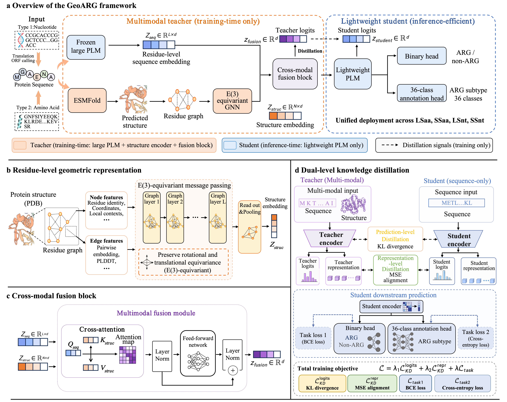

<div align="center">

# GeoARG

**Uncovering remote antibiotic resistance genes from metagenomics with geometric deep learning**

<br/>

[](.)
[](.)
[](.)
[](.)
[](.)
[](LICENSE)

<br/>

> Sequence-homology tools miss ARGs that have diverged beyond recognition — yet still perform the same resistance function. **GeoARG** closes this gap by incorporating 3D catalytic-site geometry into training, then distilling that structural knowledge into a lightweight sequence-only student model for large-scale deployment.

---

</div>

## 💡 Why GeoARG?

| | Feature | Detail |
|:---:|---------|--------|
| 🧬 | **All Input Types** | Identifies ARGs across long/short nucleotide and amino acid sequences — no separate models needed |
| 🔬 | **Remote Homologs** | Detects resistance genes down to **<25% sequence identity** to known ARGs |
| ⚡ | **15.4× Faster** | Student model runs inference at 15.4× the speed of the full structural teacher with no measurable performance loss |

---

## 🏗️ Architecture

<div align="center">

</div>

<br/>

GeoARG follows a **teacher–student** design with three coordinated modules:

| Module | Role |
|--------|------|
| **Large PLM (ESM2-650M)** + **E(3)-Graph Encoder** | Extract sequence embeddings and residue-level structural geometry |
| **Multimodal Fusion Block** | Fuse sequence and structure via cross-attention ($Q_\text{seq}$, $K_\text{struc}$, $V_\text{struc}$) |
| **Knowledge Distillation** | Transfer teacher's structural knowledge to a lightweight student PLM (ESM2-35M) at both logit and embedding levels |

**Distillation objective:**

$$\mathcal{L} = \lambda_1 \underbrace{\mathrm{KL}(y_\text{teacher} \| y_\text{student})}_{\mathcal{L}_\text{logits}} + \lambda_2 \underbrace{\tfrac{1}{d}\|z_\text{teacher} - z_\text{student}\|_2^2}_{\mathcal{L}_\text{fusion}} + \underbrace{\mathrm{CE}(y_\text{true},\, y_\text{student})}_{\mathcal{L}_\text{task}}$$

> At inference, **only the student is used** — no structure required.

---

## 📊 Results

### ARG Identification (UniProt benchmark)

| Method | Accuracy | MCC | AUROC |
|--------|:--------:|:---:|:-----:|
| **GeoARG** | **0.9892** | **0.9684** | **0.9999** |
| ARGNet | 0.9639 | 0.9076 | 0.9975 |
| HMD-ARG | 0.9521 | 0.9101 | 0.9597 |
| DeepARG | 0.9418 | 0.9041 | 0.9618 |

### Remote Homolog Detection (ResFinderFG, 0–40% identity bin)

| Method | Recall |
|--------|:------:|
| **GeoARG** | **0.48** |
| HMD-ARG | 0.11 |
| ARGNet | 0.02 |

> 📌 **24× better recall** than ARGNet on the hardest remote homologs

### Inference Efficiency

| Model | Parameters | Time (s) | Speedup |
|-------|:----------:|:--------:|:-------:|
| Teacher (ESM2-650M + E(3)-GNN) | 663.8M | 1709 | 1× |
| **Student (ESM2-35M)** | **33.5M** | **111** | **15.4×** |

---

## 📦 Installation

```bash
git clone https://github.com/XingqiaoLin/GeoARG
cd GeoARG

conda create -n geoarg python=3.10 -y
conda activate geoarg

pip install torch torchvision --index-url https://download.pytorch.org/whl/cu118
pip install fair-esm biopython safetensors tqdm scikit-learn
```

| Requirement | Version |
|-------------|---------|
| Python | ≥ 3.10 |
| PyTorch | ≥ 2.0 |
| CUDA | 11.8+ |
| VRAM (teacher training) | 24 GB |
| VRAM (student inference) | 8 GB |

---

## 🖥️ Usage

### ▸ Inference

Run `infer.py` to predict ARGs from a FASTA file:

```bash
python infer.py \
    --fasta sequences.fasta \
    --base_model /path/to/checkpoints/merged_model \
    --out_csv predictions.csv \
    --local_files_only
```

<details>
<summary><b>Full argument reference</b></summary>

<br/>

| Argument | Default | Description |
|----------|---------|-------------|
| `--fasta` | — | Input protein FASTA file(s) |
| `--base_model` | `facebook/esm2_t12_35M_UR50D` | HF model name or local checkpoint path |
| `--out_csv` | — | Output CSV path |
| `--thr` | `0.5` | Decision threshold on predicted probability |
| `--batch_size` | `4` | Sequences per batch |
| `--max_length` | `1022` | Tokenizer max length (ESM2 standard) |
| `--dtype` | `float32` | Model dtype: `float32` / `float16` / `bfloat16` |
| `--device` | auto | `cuda` or `cpu` |
| `--local_files_only` | — | Load model from local cache only (no network) |

</details>

Output CSV columns (binary classification): `seq_id`, `prob`, `pred`

### ▸ Training

```bash
python train.py
```

Configure paths in `train.py`:

```python
TRAIN_CSV = "/path/to/arg_train.csv"   # columns: header, sequence, label1
TEST_CSV  = "/path/to/arg_test.csv"
TRAIN_PDB = "/path/to/train_pdbs/"    # ESMFold-predicted PDB per sequence
TEST_PDB  = "/path/to/test_pdbs/"
SAVE_DIR  = "/path/to/checkpoints/"
```

Training runs in two phases automatically:

1. **Phase 1** — Teacher training (ESM2-650M backbone, last 4 layers unfrozen + E3-GNN + CrossAttention)
2. **Phase 2** — Student distillation (ESM2-35M, teacher frozen)

### ▸ Predict Structures with ESMFold

```bash
python -m esm.scripts.fold -i sequences.fasta -o pdbs/ --tqdm
```

---

## 📋 Data Format

**CSV** — one row per protein:

| header | sequence | label1 |
|--------|----------|--------|
| protein_001 | MKKFTREDW... | 1 |
| protein_002 | MVHLTPEEK... | 0 |

**PDB directory** — one `.pdb` file per sequence, named `{header}.pdb`

---

## 📁 Repository Structure

```
GeoARG/
├── models.py       # Teacher, Student, E3GNN, CrossAttention, DistillationLoss
├── train.py        # Two-phase training entry point
├── trainer.py      # Epoch-level train / eval loops
├── data.py         # Dataset, PDB→graph parser, collate_fn
├── utils.py        # Metrics, seed, sequence utilities
├── workflow.png    # Architecture figure
├── checkpoints/    # Saved model weights (.safetensors)
└── skills/novel-arg-watch/  # Date-gated novel ARG literature skill
```

> 💾 Model weights available at [zenodo.org/records/19295211](https://zenodo.org/records/19295211)

---

## 🌐 Web Server

For single-sequence or batch prediction without local setup:

**🔗 [https://ycclab.cuhk.edu.cn/GeoARG/](https://ycclab.cuhk.edu.cn/GeoARG/)**

Accepts FASTA input · Returns ARG probability, predicted resistance class, and confidence score.

---

## 🛠️ Agent skill (Cursor / Codex)

`novel-arg-watch` searches papers after a cutoff date and puts every named gene through two gates:

| Gate | Question | Fails when |
|------|----------|-----------|
| **Date** | Was anything about this gene public before the cutoff? | a preprint or earlier article already named it |
| **Evidence** | Did the paper prove the gene causes resistance? | only an isolate MIC, a purified enzyme, a plasmid transfer, or a prediction |

The evidence gate reads the open-access full text and keeps only sentences where the gene name, a gene-level experiment, and a susceptibility change appear together — then hands back that sentence. A claim with no quotable sentence does not pass, and wording found only in an abstract does not either.

```bash
python skills/novel-arg-watch/scripts/verify.py            # offline self-test
python skills/novel-arg-watch/scripts/install.py --codex   # or --cursor
```

All skill files live at [`skills/novel-arg-watch/`](https://github.com/XingqiaoLin/GeoARG/tree/main/skills/novel-arg-watch). Python 3.9+, standard library only, no API key.

Retrieval sweeps Europe PMC and PubMed with queries chunked by drug class and gene family, keeps preprints, and ranks screened candidates so the most likely new genes are read first.

Scripts in the skill never mark a gene as a finished novel ARG; a passing row means a human has a quote to check. Sequence download is not part of the default run.

---

## 📄 License

This project is licensed under the MIT License — see the [LICENSE](LICENSE) file for details.
